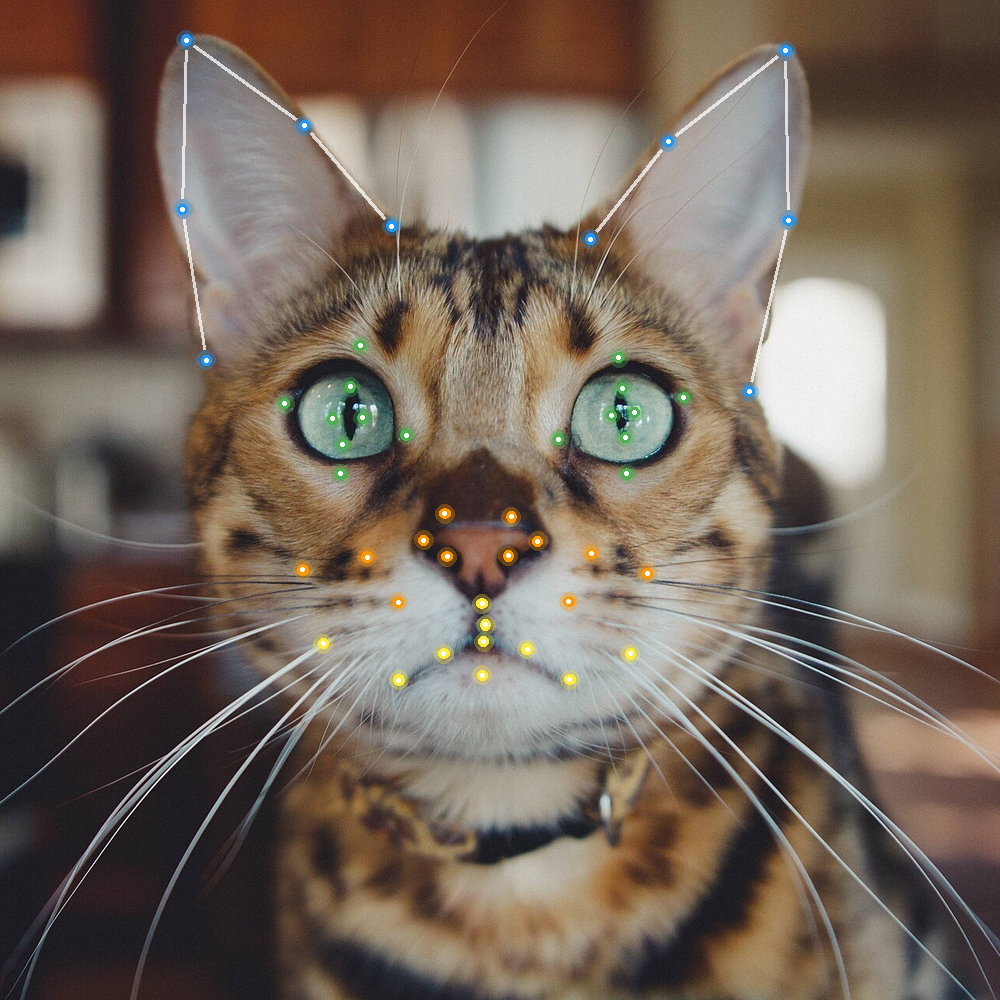

# cat-face-landmarks-training



<sub>The 48 landmarks predicted by the models trained here (face localizer, then landmark model) on "Wide-eyed tiger cat" by Caleb Woods (CC0, [Wikimedia Commons](https://commons.wikimedia.org/wiki/File:Wide-eyed_tiger_cat_%28Unsplash%29.jpg)). Blue: ears. Green: eyes. Orange: nose. Yellow: mouth and chin.</sub>

Training code, evaluation harness, and experiment journal for the cat facial
landmark models that ship in the
[cat_detection](https://pub.dev/packages/cat_detection) Flutter package
([source](https://github.com/hugocornellier/cat_detection)).

The trained weights themselves are on Hugging Face at
[hugocornellier/cat-face-landmarks](https://huggingface.co/hugocornellier/cat-face-landmarks)
and on Kaggle at
[hugocornellier/cat-face-landmarks](https://www.kaggle.com/models/hugocornellier/cat-face-landmarks), under CC BY-NC 4.0.

Two models are produced here, both exported to TFLite:

- **Face localizer**, which finds and crops the cat's face
- **Landmark detector**, which predicts the 48-point CatFLW scheme on that crop

## Results

Accuracy is NME_IOD (normalized mean error, inter-ocular distance) on the CatFLW
holdout split of 311 images. Lower is better. The paper's ELD ensemble target is
2.91; this project started at 3.72.

| Model | Backbone | Res | NME_IOD | + TTA | TFLite |
|---|---|---|---|---|---|
| `tight_margin_448_cosine_swa` | EfficientNetV2S | 448 | **3.27** | **3.11** | 55 MB |
| `tight_margin_448_long` | EfficientNetV2S | 448 | 3.27 | 3.13 | 55 MB |
| `small_v3large_384_long` | MobileNetV3Large | 384 | **3.48** | **3.31** | **11 MB** |
| `small_v3small_256` | MobileNetV3Small | 256 | 4.65 | | 5.6 MB |

`small_v3large_384_long` is what ships in the Flutter package: it is the best
accuracy that still runs in real time on a phone. Architecture across all of them
is backbone + 4x Conv2DTranspose heatmap head + SoftArgmax2D.

The full 12-model table, six rounds of experiments, per-landmark error analysis,
and a ranked list of what failed and why are in
[`LANDMARK_DETECTION_REPORT.md`](LANDMARK_DETECTION_REPORT.md). That journal is
the most useful thing in this repo. If you are picking this up to push the number
down, start there rather than here.

## Read this before exporting any model

The static-vs-dynamic TFLite export choice is a property of the LiteRT version,
not of the model, and it has already inverted once between releases: a 1.58x win
on flutter_litert 3.6.0 became a 2.13x loss on 3.7.0, with byte-identical
accuracy. Benchmark both exports against the exact runtime version you ship
against, never against Python `tf.lite`. The full account is at the top of the
journal.

For the GPU, the landmark model also needs the ReLU after each deconv split out of
`TRANSPOSE_CONV` (version 4 to 3), which the batch-1 conversion does not do by
itself. `scripts/reexport_static.py` does both and fails if the result is not
GPU-ready. See the journal's 2026-09-24 entry.

## Setup

```bash
pip install -r requirements.txt
```

`requirements.txt` pins `tensorflow-macos` and `tensorflow-metal`, so it installs
as-is only on Apple Silicon. On Linux or CUDA, substitute `tensorflow==2.15.0`
and drop the `-metal` package; nothing in the training scripts is
platform-specific beyond that.

The CatFLW dataset is pulled automatically through `kagglehub` on first run, to
your own machine, under your own acceptance of Kaggle's terms. No dataset content
is redistributed in this repository.

## Training

```bash
# Best overall (EfficientNetV2S 448px, cosine + SWA)
python scripts/train_cat_face_landmarks.py --experiment tight_margin_384 \
  --img-size 448 --batch-size 4 --finetune-epochs 400 \
  --finetune-learning-rate 2e-5 --lr-schedule cosine --use-swa \
  --swa-start-frac 0.65 --out artifacts/tight_margin_448_cosine_swa

# Best small model (MobileNetV3Large 384px), the one that ships
python scripts/train_cat_face_landmarks.py --experiment small_v3large_384 \
  --finetune-epochs 400 --finetune-last-layers 60 \
  --out artifacts/small_v3large_384_long

# Face localizer
python scripts/train_cat_face_detector.py
```

Evaluation:

```bash
python scripts/eval_multiscale_tta.py --model artifacts/<run>/best.keras \
  --experiment small_v3large_384      # TTA evaluation of one model
python scripts/eval_all_models.py     # every model plus ensembles
python scripts/pareto_harness_cat.py  # accuracy of a converted .tflite
```

More commands, including the full resolution sweep, are in the journal's Quick
Reference section.

## Weights

The trained weights are released on Hugging Face:

**[hugocornellier/cat-face-landmarks](https://huggingface.co/hugocornellier/cat-face-landmarks)**

That repository holds the face localizer and `cat_face_landmarks_full.tflite`
(11 MB, ships in the Flutter package), the `.keras` sources for fine-tuning, and
the per-model training config and epoch logs. The model card documents the input
and output contract, which is the part you need to actually use them.

The same files are on Kaggle at
[hugocornellier/cat-face-landmarks](https://www.kaggle.com/models/hugocornellier/cat-face-landmarks),
with a demo notebook, [Cat Facial Landmarks on CatFLW
(TFLite)](https://www.kaggle.com/code/hugocornellier/cat-facial-landmarks-on-catflw-tflite),
that runs both stages on a CatFLW image.

Until 24 September 2026 both also had the EfficientNetV2-S 448 landmark model
(55 MB). It was withdrawn so that every released file runs on LiteRT's
CompiledModel, CPU and GPU; the journal's 2026-09-24 entry has the reasons. It
stays in the Hugging Face history and in version 1 on Kaggle.

Weights are **CC BY-NC 4.0**, non-commercial. See the License section below for
why, and note that the code here is Apache 2.0: the two are different.

## Dataset

Models here are trained on the
[CatFLW dataset](https://github.com/martvelge/CatFLW) by Martvel et al.,
Tech4Animals Lab, University of Haifa.

CatFLW is licensed
[CC BY-NC 4.0](https://creativecommons.org/licenses/by-nc/4.0/). Obtain it from
[Kaggle](https://www.kaggle.com/datasets/georgemartvel/catflw) under its own
terms. No images, annotations, or derived crops from the dataset are included
here.

## License

This repository carries two licenses, because the code and the weights come from
different places.

- **Code** (everything in this repository): Apache License 2.0, see
  [`LICENSE`](LICENSE).
- **Trained weights** (released on Hugging Face, see above): CC BY-NC 4.0, see
  [`LICENSE-WEIGHTS`](LICENSE-WEIGHTS).

The weights are non-commercial at the request of the dataset authors, who asked
that weights derived from CatFLW annotations remain consistent with the
non-commercial terms of the source data. They granted permission to publish them
on that basis.

## Citation

If you use this work, please cite the CatFLW papers:

```bibtex
@article{martvel2023catflw,
  title={Catflw: Cat facial landmarks in the wild dataset},
  author={Martvel, George and Farhat, Nareed and Shimshoni, Ilan and Zamansky, Anna},
  journal={arXiv preprint arXiv:2305.04232},
  year={2023}
}

@article{martvel2024automated,
  title={Automated Detection of Cat Facial Landmarks},
  author={Martvel, George and Shimshoni, Ilan and Zamansky, Anna},
  journal={International Journal of Computer Vision},
  pages={1--16},
  year={2024},
  publisher={Springer}
}
```

## Acknowledgements

Thanks to George Martvel, Nareed Farhat, Ilan Shimshoni, and Anna Zamansky at the
Tech4Animals Lab, University of Haifa, for publishing CatFLW and for permission
to release these weights.
